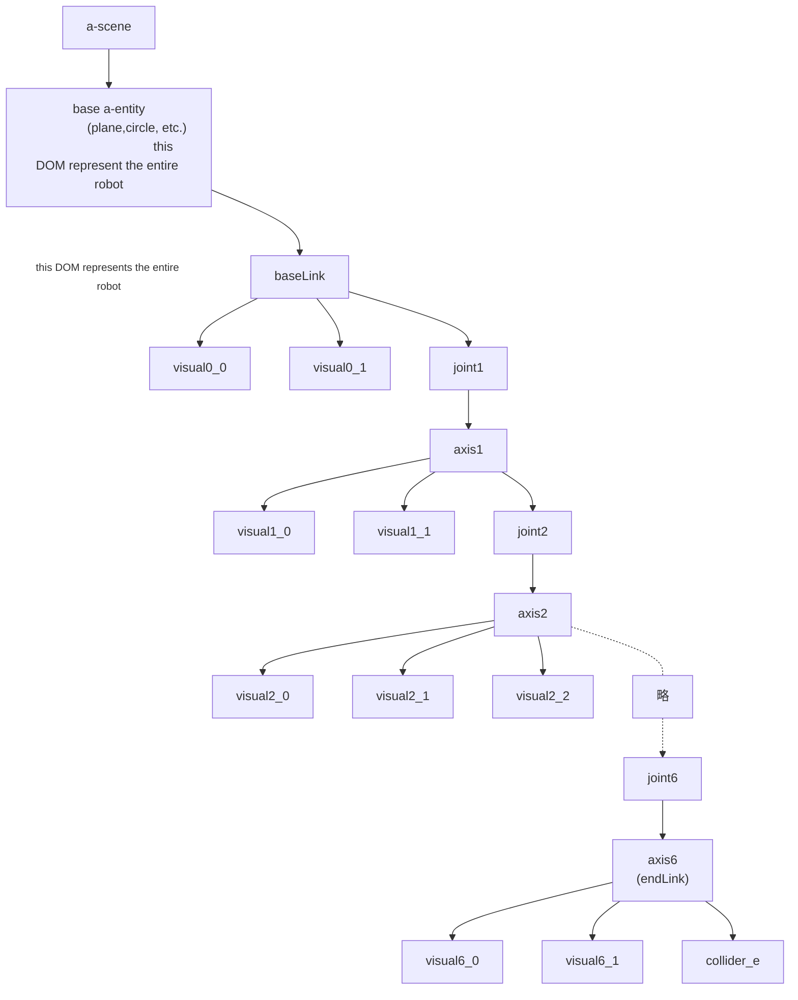

# A-Frame components for animating robot arms in A-Frame using ik-cd-worker


## Example of using robot-loader library in Next.js + A-Frame project
You can see an example of using this library in the repository below:
```
git clone -b main https://github.com/TSUSAKA-ucl/unitree-g1-nextjs-exmaple.git 
cd unitree-g1-nextjs-exmaple
pnpm install
npx copy-assets
pnpm dev
```

## library registry

This package is not registered in `npmjs.org`, but can be intalled from 
[github Packages](https://github.com/orgs/ucl-nuee/packages/npm/package/robot-loader).
To install from github Packages, you need to set up `.npmrc` file as follows:
```
//npm.pkg.github.com/:_authToken=<GITHUB_PERSONAL_ACCESS_TOKEN>
@ucl-nuee:registry=https://npm.pkg.github.com/
registry=https://registry.npmjs.org/
```
When using this library, you will need the assets in addition to the library code.
The frontend must be able to fetch `ik_cd_worker.js` and the robot's assets, 
such as `urdf.json` and meshes.
They can be copied from other packages in `npx copy-assets` command as shown in the example above.
They will **not be bound** by a JavaScript binder such as Rollup or Webpack.

## A-Frame components in this repository
The components in the table below are defined in this repository

| A-Frame components | file name |
|--------------------|-----------|
|`a-axes-frame` | `axesFrame.js`|
|`add-frame-to-joints` | `addFrameToJoints.js`|
|`add-frameObject` | `axesFrame.js`|
|`arm-motion-ui` | `armMotionUI.js`|
|`attach-color-recursively` | `ChangeOpacity.js`|
|`attach-opacity-recursively` | `ChangeOpacity.js`|
|`attach-to-another` | `attachToAnother.js`|
|`base-mover` | `baseMover.js`|
|`change-color` | `ChangeOpacity.js`|
|`change-opacity` | `ChangeOpacity.js`|
|`change-original-color` | `ChangeOpacity.js`|
|`change-original-color-recursively` | `ChangeOpacity.js`|
|`event-distributor` | `robotRegistry.js`|
|`event-forwarder` | `attachToAnother.js`|
|`exact_solution` | `reflectWorkerJoints.js`|
|`finger-closer` | `fingerCloser.js`|
|`ik-worker` | `ikWorker.js`|
|`joint-desirable` | `ikWorker.js`|
|`joint-desirable-vlimit` | `ikWorker.js`|
|`joint-move-to` | `jointMoveTo.js`|
|`joint-weight` | `ikWorker.js`|
|`reflect-collision` | `reflectCollision.js`|
|`reflect-joint-limits` | `reflectJointLimits.js`|
|`reflect-worker-joints` | `reflectWorkerJoints.js`|
|`robot-loader` | `robotLoader.js`|
|`robot-registry` | `robotRegistry.js`|
|`target-selector` | `robotRegistry.js`|
|`thumbmenu-event-handler` | `vrControllerThumbMenu.js`|
|`thumbstick-menu` | `vrControllerThumbMenu.js`|

## a-entity tree example made by robot-loader

`joint` a-entity represents a transform from parent link origin to the next joint axis.
`axis` a-entity represents a transform of each joint axis.
`visual` a-entity represents a visual mesh of each link.
Please refer to the [URDF specification](https://wiki.ros.org/urdf/XML/joint) for more details
about joints and links.
